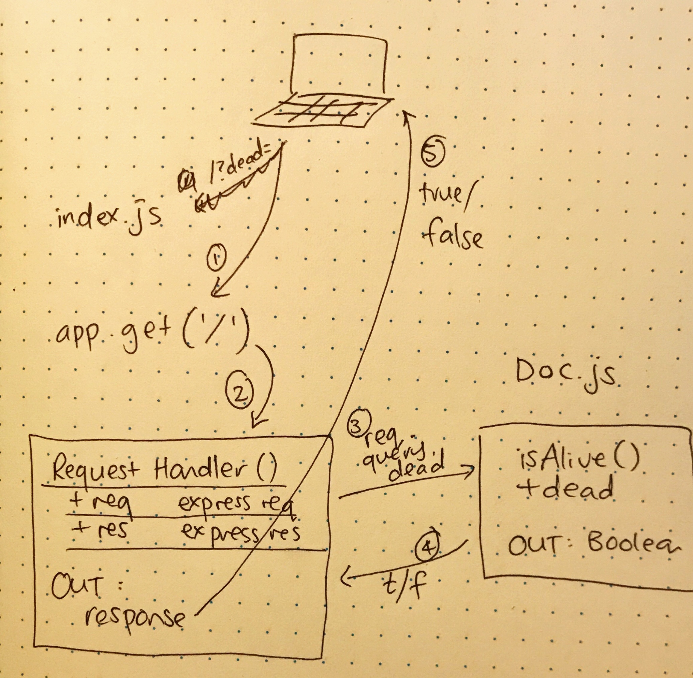

# LAB - 00

## Proof of life server

### Author: Joanna Arroyo

### Links and Resources
* [submission PR](https://github.com/joanna-401-advanced-javascript/lab-00-deployment/pull/1)
* [travis](https://travis-ci.com/joanna-401-advanced-javascript/lab-00-deployment)
* [front-end](https://joanna-lab-00.herokuapp.com/)

#### Documentation
* [jsdoc](https://joanna-lab-00.herokuapp.com/docs/)

### Modules
#### `pol.js`
##### Exported Values and Methods

###### `isAlive(dead) -> boolean`
Returns true/false to indicate how the server works

### Setup
#### `.env` requirements
* `PORT` - Port Number

#### Running the app
* `npm start`
* Endpoint: `/`
  * Returns a boolean
* Endpoint: `/docs`
  * Returns JSDoc Documentation Page
  
#### Tests
* Unit Test: `npm test`
* Lint Test: `npm run lint`

Incomplete Test:
- Need to test xy...

#### UML
